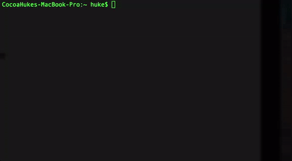

# rootshell
- Simple wrap of **sudo**
- Carry current user environment variables to root
- Keep user's home directory
```
bash-3.2$ export USER_ENV="test_value"
bash-3.2$ rootshell
rootshell-3.2# echo $USER_ENV
test_value
rootshell-3.2# echo ~
/Users/user
rootshell-3.2#
```

<<<<<<< HEAD
Tested on MacOS
=======
###simple wrap of sudo login without password everytime


test in Macos/linux debian
>>>>>>> origin/master
